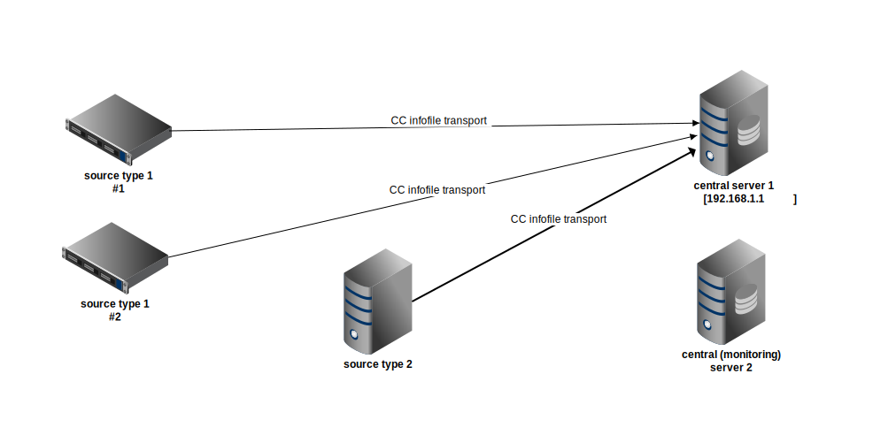

#######################
CC -- Command & Control
#######################
============
CC use cases
============

Info file transport
###################

Description
===========

Common scenario is to transfer service infofiles from one location to another.
Simplified approach is from many server instances to single monitoring server.
For more complex scenarios please also see e.g. `proxy use case`_.

Infofiles on a source server can be identified by a filename mask in a
directory.  Infofiles are usually created at regular intervals (5 seconds,
1 minute, 5 minutes, x hours) and need to be transferred as they change.

Infofiles are mostly text files, containing service statistics / health /
performance related information.  However, we can transport any files, not just
logs.  We can either pick up a file or we can create it on the fly -- meaning
we grab output from any command run and send it over (together with generated
filename) and it is saved on the other side.

Example
=======

Here we present a simple example scenario where multiple sources (hosts
producing info data) connect to central server.  There collected infofiles can
be just stored or further processed.

Diagram
-------

Configuration
-------------

Central server
~~~~~~~~~~~~~~

This is a host that collects all info files.
(Its address in this example is 192.168.1.1)
::

    [ccserver]
    pidfile = /var/run/cc/%(job_name)s.pid
    logfile = /var/log/cc/%(job_name)s.log

    # listening socket for this CC instance
    cc-socket = tcp://0.0.0.0:22632

    # either 'local' or 'remote'
    cc-role = remote

    # msgtype -> handler mapping
    [routes]
    pub.infofile = h:infowriter

    [h:infowriter]
    handler = cc.handler.infowriter
    dstdir = /data/infofiles
    host-subdirs = yes
    bakext = --prev
    #write-compressed = keep

Source type 1
~~~~~~~~~~~~~

This is a config for (each) log producer.  Local CC instance will monitor
requested directory and send new / modified files over to central server.
::

    [ccserver]
    pidfile = /var/run/cc/%(job_name)s.pid
    logfile = /var/log/cc/%(job_name)s.log

    cc-socket = tcp://127.0.0.1:22632
    cc-role = local

    [routes]
    # local routes
    log = h:locallog
    job = h:jobmgr

    # remote routes
    pub = h:forward

    # send message to local logfile
    [h:locallog]
    handler = cc.handler.locallogger

    # send message to remote CC
    [h:forward]
    handler = cc.handler.proxy
    remote-cc = tcp://192.168.1.1:22632

    # manage sub-daemons
    [h:jobmgr]
    handler = cc.handler.jobmgr
    daemons = d:infosender

    # subdaemon that collects and sends infofiles, launched by jobmgr
    [d:infosender]
    module = cc.daemon.infosender
    infodir = /home/nagios
    infomask = info.*
    #compression = gzip
    #compression-level = 1

Source type 2
~~~~~~~~~~~~~

This is a config for another type of info data.  This time it is generated on
the fly -- requested command is run and its output (together with chosen
filename) is send over to central server where it gets saved in the same way
as logs from source type 1 above.
::

    [ccserver]
    pidfile = /var/run/cc/%(job_name)s.pid
    logfile = /var/log/cc/%(job_name)s.log

    cc-socket = tcp://127.0.0.1:22632
    cc-role = local

    [routes]
    # local routes
    log = h:locallog
    job = h:jobmgr

    # remote routes
    pub = h:forward

    # send message to local logfile
    [h:locallog]
    handler = cc.handler.locallogger

    # send message to remote CC
    [h:forward]
    handler = cc.handler.proxy
    remote-cc = tcp://192.168.1.1:22632

    # manage sub-daemons
    [h:jobmgr]
    handler = cc.handler.jobmgr
    daemons = d:infoscript

    # subdaemon that generates and sends infofiles, launched by jobmgr
    [d:infoscript]
    module = cc.daemon.infoscript
    info-name = info.server-stats.pl
    info-script = sudo -H -n -u nagios /home/nagios/server-stats.pl
    info-period = 10
    #compression = gzip
    #compression-level = 1

More info
=========

- `CC daemons`_ .. InfoScript, InfoSender
- `CC handlers`_ .. InfoWriter

.. _`proxy use case`: proxying.rst
.. _`CC daemons`: ../components/daemons.rst
.. _`CC handlers`: ../components/handlers.rst
