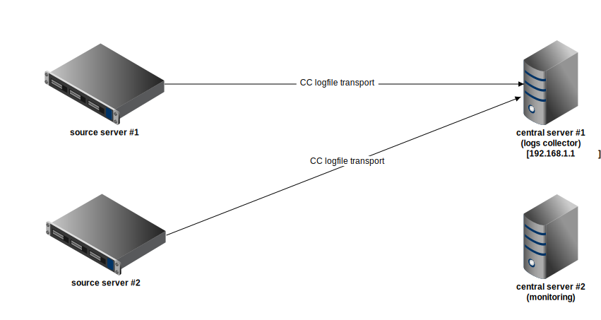

#######################
CC -- Command & Control
#######################
============
CC use cases
============

Log file transport
##################

Description
===========

Another common scenario is transferring log files from one location to another.
This use case is similar to `Info file transport`_ but its needs and thus
approach is different.  In this case the files grow fast (e.g. logs from
PostgreSQL under heavy usage).  Instead of monitoring a directory and
(re)sending matching files when they appear / change, it is better to watch
files as they grow and send over just newly added data (fragments).  This
avoids resending of whole files, evens out cpu/io load and makes (partial)
files available at target location as soon as possible.

Note that log files are mostly of text type, but we can watch and transport any
files.  Actually, since ver.0.8.7, there is explicit support for binary files
(can be used with text files too).

The implementation assumes that:

- All log files reside in the same directory.
- We can find last log file by sorting the file list alphabetically.

When log is switched, the tailer continues tailing from the next file.
When the tailer is restarted, it continues tailing from saved position.
This is useful when (temporarily) under pressure or restarted due to upgrade,
as we can catch up and not miss any log data.  This behaviour depends on new
config option (see example config below).

The implementation supports 2 operating modes now: `classic`, `rotated`.
The former is explained above.  The latter is intended for logs written via
e.g. newsyslog or Python's [Timed]RotatingFileHandler -- When log is switched,
the tailer continues tailing from reopened file.  This assumes that files sent
in this mode (with op_mode='rotated' attribute) will not rotate more often than
once per second.

Example
=======

Here we present a simple example scenario where multiple sources (hosts
producing log files) connect to central server.  There collected log files can
be just stored or further processed.

Diagram
-------

Configuration
-------------

Central server
~~~~~~~~~~~~~~

This is a host that collects all log files.
(Its address in this example is 192.168.1.1)
::

    [ccserver]
    pidfile = /var/run/cc/%(job_name)s.pid
    logfile = /var/log/cc/%(job_name)s.log

    # listening socket for this CC instance
    cc-socket = tcp://0.0.0.0:22632

    # either 'local' or 'remote'
    cc-role = remote

    # msgtype -> handler mapping
    [routes]
    pub.logtail = h:tailwriter

    [h:tailwriter]
    handler = cc.handler.tailwriter
    dstdir = /data/logfiles
    host-subdirs = yes
    #write-compressed = keep

Source type 1
~~~~~~~~~~~~~

This is a config for a log producer of type handled by 'classic' mode of
operation.  Local CC instance will monitor requested directory and send file
data over to central server.
::

    [ccserver]
    pidfile = /var/run/cc/%(job_name)s.pid
    logfile = /var/log/cc/%(job_name)s.log

    cc-socket = tcp://127.0.0.1:22632
    cc-role = local

    [routes]
    # local routes
    log = h:locallog
    job = h:jobmgr

    # remote routes
    pub = h:forward

    # send message to local logfile
    [h:locallog]
    handler = cc.handler.locallogger

    # send message to remote CC
    [h:forward]
    handler = cc.handler.proxy
    remote-cc = tcp://192.168.1.1:22632

    # manage sub-daemons
    [h:jobmgr]
    handler = cc.handler.jobmgr
    daemons = d:logtail

    # subdaemon that tails log files, launched by jobmgr
    [d:logtail]
    module = cc.daemon.logtail
    logdir = /pg_log
    logmask = postgresql-*.log
    lag-max-bytes = 256 MB
    #compression = gzip
    #compression-level = 1

Source type 2
~~~~~~~~~~~~~

This is a config for a log producer of type handled by 'rotated' mode of
operation.  Local CC instance will monitor requested directory and send file
data over to central server.
::

    [ccserver]
    pidfile = /var/run/cc/%(job_name)s.pid
    logfile = /var/log/cc/%(job_name)s.log

    cc-socket = tcp://127.0.0.1:22632
    cc-role = local

    [routes]
    # local routes
    log = h:locallog
    job = h:jobmgr

    # remote routes
    pub = h:forward

    # send message to local logfile
    [h:locallog]
    handler = cc.handler.locallogger

    # send message to remote CC
    [h:forward]
    handler = cc.handler.proxy
    remote-cc = tcp://192.168.1.1:22632

    # manage sub-daemons
    [h:jobmgr]
    handler = cc.handler.jobmgr
    daemons = d:logtail

    # subdaemon that tails log files, launched by jobmgr
    [d:logtail]
    module = cc.daemon.logtail
    operation-mode = rotated
    logdir = /opt/ppingd/log
    logname = pping-stats.log
    #compression = gzip
    #compression-level = 1

More info
=========

- `CC daemons`_ .. LogfileTailer
- `CC handlers`_ .. TailWriter

.. _`Info file transport`: infofile_transport.rst
.. _`CC daemons`: ../components/daemons.rst
.. _`CC handlers`: ../components/handlers.rst
