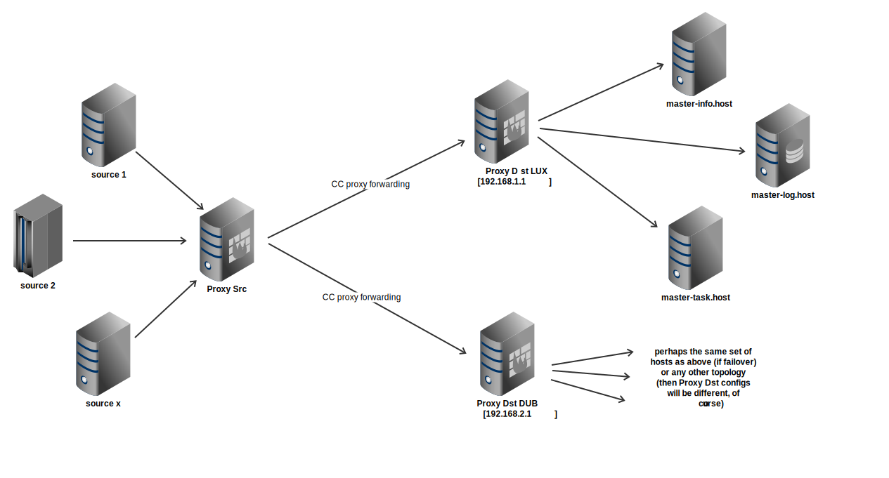

#######################
CC -- Command & Control
#######################
============
CC use cases
============

Proxy - Gateway - Bridge
########################

Description
===========

It is often desirable to have one entry point that can forward messages as
required.  This may be seen as a gateway.  Or build a link across networks with
one side acting as a sink and the other one as a dispatcher.  This may be seen
as a bridge.  Proxy component can do these and much more.

Example
=======

Here we present an example where local data (CC messages) sources connect to
local proxy which forwards messages to destination (perhaps across networks).
Also, as shown, we can duplicate data for multiple destinations (collocations).
There, on destination side(s), we can dispatch messages as appropriate.

Diagram
-------

Configuration
-------------

Proxy Src
~~~~~~~~~

Proxy on source side acts as a sink for all messages that need to be forwarded
across networks.  It can duplicate messages in order for them to be delivered
to multiple destinations (e.g. fail-over collocations).
::

    [ccserver]
    pidfile = ~/pid/%(job_name)s.pid
    logfile = ~/log/%(job_name)s.log

    cc-socket = tcp://0.0.0.0:22632
    cc-role = remote

    # msgtype -> handler mapping
    [routes]
    log = h:remote-lux , h:remote-dub
    pub.infofile = h:remote-lux , h:remote-dub
    task = h:remote-lux , h:remote-dub
    echo = h:echo

    # echo service
    [h:echo]
    handler = cc.handler.echo

    # send messages to remote CCs

    [h:remote-lux]
    handler = cc.handler.proxy
    remote-cc = tcp://192.168.1.1:22632
    ping = yes

    [h:remote-dub]
    handler = cc.handler.proxy
    remote-cc = tcp://192.168.2.1:22632
    ping = yes

Proxy Dst
~~~~~~~~~

Proxy on destination side takes care of forwarding received messages as
appropriate.  Here in this example we split messages to 3 different servers:
infofile collector, log collector, task runner.
(Btw, perhaps first 2 should be the same.)
::

    [ccserver]
    pidfile = ~/pid/%(job_name)s.pid
    logfile = ~/log/%(job_name)s.log

    cc-socket = tcp://0.0.0.0:22632
    cc-role = remote

    # msgtype -> handler mapping
    [routes]
    log = h:master-log
    pub.infofile = h:master-info
    task = h:master-task
    echo = h:echo

    # echo service
    [h:echo]
    handler = cc.handler.echo

    # send messages to remote CCs

    [h:master-info]
    handler = cc.handler.proxy
    remote-cc = tcp://master-info.host:22632
    ping = yes

    [h:master-log]
    handler = cc.handler.proxy
    remote-cc = tcp://master-log.host:22632
    ping = yes

    [h:master-task]
    handler = cc.handler.proxy
    remote-cc = tcp://master-task.host:22632
    ping = yes

Producers (source)
~~~~~~~~~~~~~~~~~~

These are simply set up to send messages to Proxy Src to forward them further.

Consumers (destination)
~~~~~~~~~~~~~~~~~~~~~~~

These will receive appropriate messages from Proxy Dst (as seen in config above).

More info
=========

- `CC handlers`_ .. ProxyHandler

.. _`CC handlers`: ../components/handlers.rst
